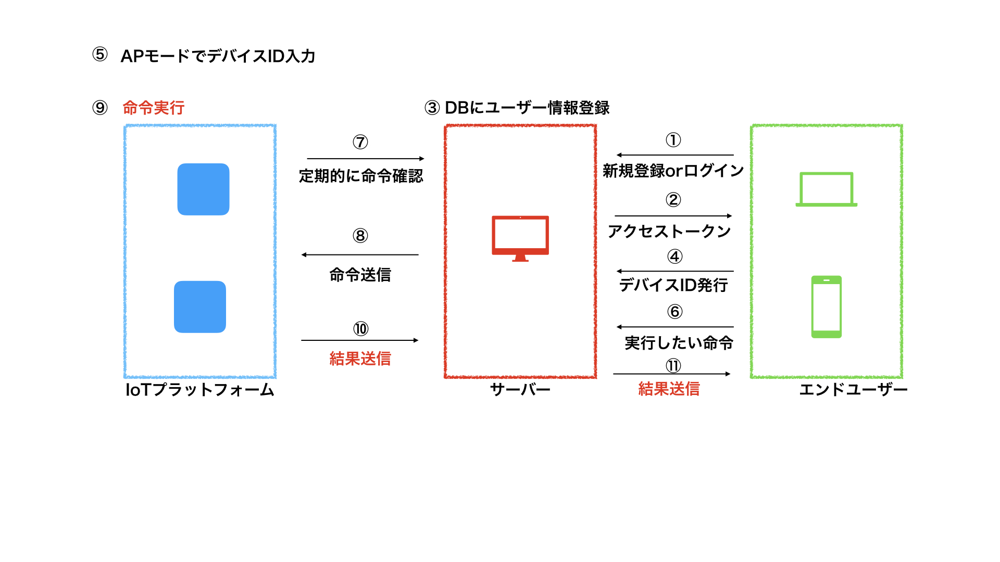
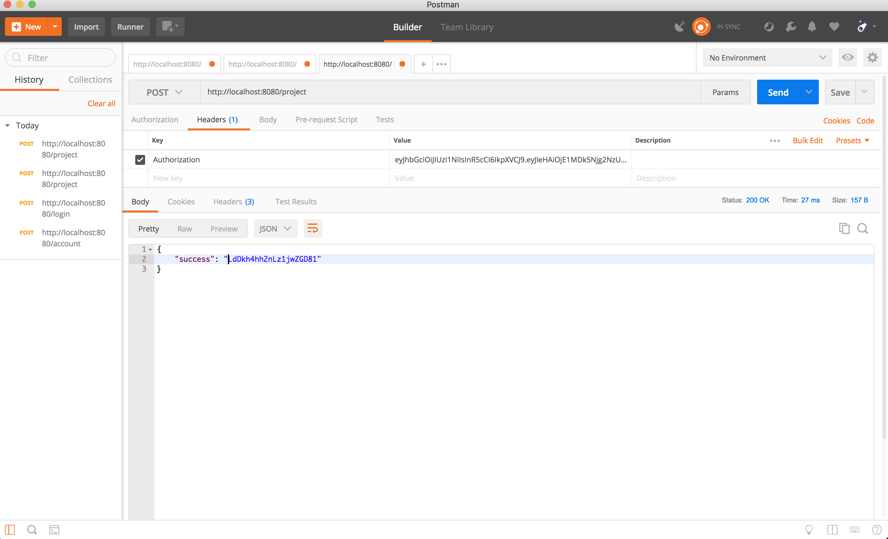
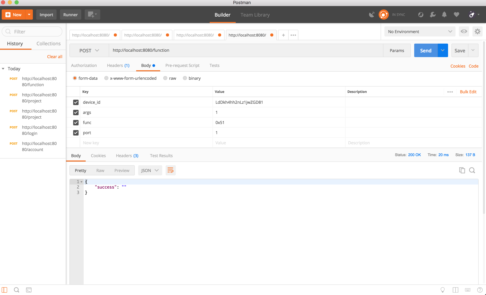

# IoTPlatformサーバ

## 環境構築
- コード取得
``` 
git clone git@github.com:HAL-RO-Developer/iot_platform.git

cd iot_platform.git 
cp server/model/config.go.sample server/model/config.go 
```

- go言語環境構築<br>
バージョン 1.9.2<br>
[参照サイト](https://qiita.com/spiegel-im-spiegel/items/dca0df389df1470bdbfa)
- mysqlバージョン　5.7.20<br>
[mysqlダウンロードページ](https://dev.mysql.com/downloads/installer/)

- 動作確認用 POSTMAN<br>
[POSTMANダウンロードページ](https://www.getpostman.com)

## 使用パッケージ
- gin
- gorm
- mysql
- jwt-go

## 動作イメージ

＊赤字は未実装

## 動作手順
1. 下記コマンドでmysql起動<br>
```
mysql server start
```

2. コードを保存したディレクトリまで移動後、下記コマンドでサーバ起動<br>
```
go run main.go
```

## 動作デモ
### 新規アカウント作成(①)


### ログイン(①)


### デバイスID発行(④)


### 実行したい命令(⑥)


### 命令送信(⑧)


## deviceの生成
`go run cmd/createDevice.go`


